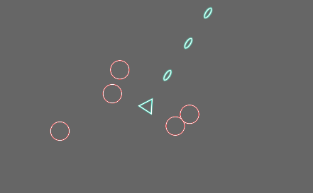

# Bevy Game Engine Tutorial

Tutorials of [Bevy](https://bevyengine.org/), a game engine with Rust.

The goal of this course is creating a simple shooter, inspired by `Geometry Wars`.

This tutorial is divided into some steps, please check `tutorial` and `src` directories.

* Setup and Show Texture
* About ECS (Entity Component System)
* Mouse and Keyboard Events
* Update locations
* Plugins
* Collision system

> In articles, I used `Bevy 0.5`. There is possibility that these code won't work in the future.