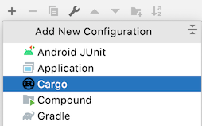
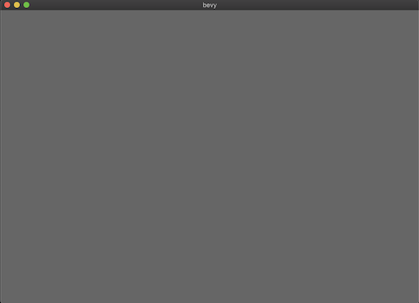
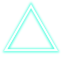

Making Shooting Game With Bevy(1)

Rust is becoming a imortant programming language recently. Many big companies, including Microsoft/Google, is switching their using language to Rust because of its safe-memory-management. 

But for me, it was hard to find where to use Rust. I'm a mobile developer, but Rust is not suitable for Android/iOS/Web programming (Wasm is a only place to use Rust). This fact discouraged me from learning the language.

After while, I found some game engines written in Rust. Yeah, I like video games(I suppose many programmers like it), and I decided to make a simple game.

In this series of articles, I will use "Bevy", which is one of popular game engines in Rust, and make a `Geometry Wars` like shooting game, Step by Step.

<!-- more -->

## Today's Goal

* Create a window
* Show one texture

## Bevy

> Notice: This article uses **Bevy 0.4**. There is a possibility that following code won't work in the future.

Bevy is 2D and 3D game engine (Like Unity). Before I choose Bevy, I compared some game engines.

* [Amethyst](https://amethyst.rs/)
  * Great documents (compared to bevy)
  * But too large for me and it causes greater build time.
  * 6.7k stars in Github
* [Ggez](https://ggez.rs/)
  * Very simple but need to draw objects your own.
  * 2.7k stars
* [Bevy]
  * Similar to Amethyst, but lighter.
  * Newer than others
  * Less documents
  * 6.5k stars

The reason I choose Bevy was bevy's ECS-structure and fast build time. Many Github-Stars was also the reason.

# Setup

## Setup bevy

To use bevy is simple and same as other rust framework.  Only to add dependencies in `Cargo.toml`.

```toml
[dependencies]
bevy = "0.4"
```

If you use windows 10, you need to install [VS2019 build tools](https://visualstudio.microsoft.com/thank-you-downloading-visual-studio/?sku=BuildTools&rel=16)  (I forgot this process at first!).

Please check [the official setup guide](https://bevyengine.org/learn/book/getting-started/setup/) for more details.

## IDE Setup

There are major 2 IDEs for developing Rust, `VSCode `and `IntelliJ`.

I suppose that `VSCode` is much popular. But I like `IntelliJ` because I'm use to it(this is because I'm an AndroidDeveloper). 

* If you choice `VSCode`
  * Install `Rust` or `Rust-Analyzer` Plugin
  * I think `Rust-Analyzer` is better than `Rust`, especially in code completion.
  * To run app, create `launch.json` and `task.json`
    * or use terminal, with `cargo run` 
* If you choice `IntelliJ`
  * Install `Rust` Plugin
  * Add `Cargo` Run-Configuration to run
  


# Window

## Show window

The learning materials that was created by bevy is not enough. Not only the official documents is not enough, but also some of their samples in the github won'to work.

This causes me to introduce bevy setup step-by-step.

First, you need to create a window to draw your game objects. It's easy, only a few lines.

```rust
use bevy::prelude::*;

fn main() {
    App::build()
        .add_plugins(DefaultPlugins)
        .run();
}
```



Got it!

----------------------

To show window some plugins are required. But it's not easy for beginners(including me!). But `DefaultPlugins` includes varios common plugins such as UI/Timer, so you may use this plugin in most cases.

If you want to know about the detail, please check [the source code](https://docs.rs/bevy_internal/0.4.0/src/bevy_internal/default_plugins.rs.html).

## Change window size

In many case game developers want to fix the size of the window and change background-color.

To adjust window size, add `WindowDescriptor`.

```rust
fn main() {
    App::build()
        //add this    
        .add_resource(WindowDescriptor {
            title: "Game Title".to_string(),
            width: 480.0,
            height: 320.0,
            resizable: false,
            ..Default::default()
        })
        .add_plugins(DefaultPlugins)
        .add_resource(ClearColor(Color::rgb(0.0, 0.0, 0.0)))
        .run();
}
```

> Notice: You **MUST** write `WindowDescriptor` before `DefaultPlugins`.

`WindowDescriptor` indicates behaviors of the window. The following is core properties of `WindowDescriptor`.

* title: String
* width: f32
* height: f32
* resizable: bool

All properties and default values are written [here](https://docs.rs/bevy_window/0.4.0/src/bevy_window/window.rs.html#335).


# Show texture

Next, let's show a image in the window. Use following image.



## Create assets

In `Bevy`, images used in your game must be placed in `assets` folder.

Create `assets` folder and place `triangle.png` into it. This is folder-tree you need to create.

```
+[project-root]
  +-assets
    +- triangle.png
  +-src
    +- main.rs
```

## Load assets

To load assets, you need to add `setup function` and load it with `AssetServer`. (I'll explain about System in the next tutorial.)

```rust
fn setup(
    commands: &mut Commands,
    mut materials: ResMut<Assets<ColorMaterial>>,
    asset_server: ResMut<AssetServer>,
) {
    commands
        //add 2D Camera    
        .spawn(Camera2dBundle::default())
        .spawn(SpriteBundle {
            material: materials.add(asset_server.load("triangle.png").into()),
            transform: Transform::identity(),
            sprite: Sprite::new(Vec2::new(80.0, 80.0)),
            ..Default::default()
        });
}
```

`Commands` is one of the core components of bevy. It has functions such as creating/removing objects.

First, the code creates `Camera for 2D` and attach it into system (`spawn` function). I often forget add a CameraBundle (No objects appear in the window.)

Next, this create `Sprite` with

 * material with triangle.png
 * idenity transform (no scaling, no rotation)
 * 80x80 size

---------------------

You also have to add following line to call `setup` function in `main`.

```rust
      .add_plugins(DefaultPlugins)
      .add_resource(ClearColor(Color::rgb(0.0, 0.0, 0.0)))
      .add_startup_system(setup.system()) //add this line
      .run();
```

`setup` function will be called at app-startup (`add_startup_system`). And parameters of `setup` will be passed by Bevy system.


The triangle image is displayed in the center, 80x80 size.

In next chapter, I'll move this triangle with a mouse cursor.


