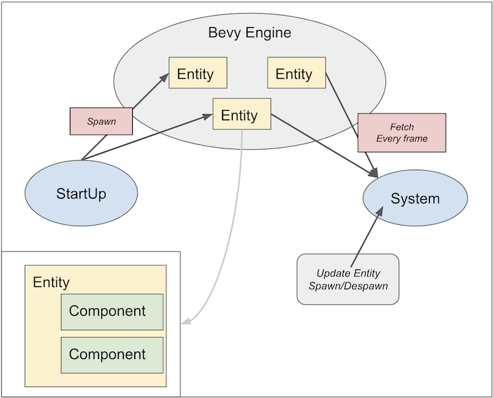

# Entity Component System

Bevy uses ECS paradigm, which is shorthand of `Entity Component System`.

It was(is) difficult for me because I'm not use to it. It is completely different from Mobile App structure.

* Component: core data, properties only
* Entity: one object, consists of batch of components, has ID
* System: function that operates Components

The following picture is an overall structure of ECS (in bevy).



1. `startup` function creates/registers entities to the Bevy Engine (spawn)
2. Each entity consists of one more components.
3. `System` fetches desired entities with `Query`.
4. `System` updates data of the entities or swawn/despawn entities.

Let's take a closer look at detail.

----------------------------

# Component & Entity

In Bevy, `Components` is a simple structure.

```rust
#[derive(Default)]
struct Position {
    x: f32,
    y: f32,
}
struct Player {
    name: String
}
struct Enemy {
    category: i32
}
```

`Entity` is a batch of components. No need to create its own struct.

```rust
//Player
spawn((
  Position::default(),
  Player { name: "Bevy" }
))
//Enemy
spawn((
  Position::default(),
  Enemy { category : 1 }
))
```

It's not difficult code, but people who come from Object-Oriented-Programming(it's me!) want to create `classes`. Similar code in usual OOP will be shown.

```java
interface IPosition {
   float getX();
}
interface IPlayer {...}

final class Player implements IPosition, IPlayer {
    //...
}
```

In ECS the class is not needed. This makes code simple and more flexible. Let's see `System`

> Usually more than 2-components are required to spawn.
> ```rust
> struct A(i32);
> strutc B(i32);
> spawn(A(0)); //can't build
> spawn((A(0), B(1))) //OK
> ```
> 
> but with adding `Bundle` simple-component is allowed.
> 
> ```rust
> #[derive(Bundle)]
> struct C(i32);
> spawn(C(0)) //OK
> ```

--------------------------------

# System

`System` is a function registered in the Bevy Engine. The role of `System` is update or spawn/despawn entities.  But `System` doesn't use `entity` directly. It uses `Components`.

`System` has `Query` as a parameter.

```rust
fn move_system(
    query: Query<&Enemy>
) {
    for e in query.iter() {
    }
}

```

This code shows that the Engine will pass *all components that include Enemy* to the function. 

Furthermore multiple component types are allowed.

```rust
fn move_system(
    mut query: Query<(&Enemy, &mut Position)>
) {
    for (e, mut p) in query.iter() {
    }
}
```

In this pattern `components that include BOTH Enemy and Position` will be passed by the Bevy Engine.

> Notice: `mut` is required in query if you want to update value.

# Example

Now, let's create a simple example without window, console only ECS system.

* Move *Blocks* right every frame
* Place some *Walls*
* Disappear the ball when hitting any walls.
* To make this simple, consider *X* axis only.

## Components & Entities

Declaring components is very simple in this example.(Because I want to focus *system*!)

```rust
struct Block(i32);

struct Wall;

struct Position(i32);
```

And spawn them.

```rust
//
fn setup(
    commands: &mut Commands,
) {
    commands
        .spawn((Block, Position(1)))
        .spawn((Block, Position(10)))
        .spawn((Wall, Position(5)))
        .spawn((Wall, Position(20)));
}

fn main() {
    App::build()
        .add_startup_system(setup.system())
        .run();
}
```

## System

Next, create `system` to print *positions of the blocks*.

```rust
fn print_system(
    query: Query<&Position, With<Block>>
) {
    println!("## Print ##");
    for p in query.iter() {
        println!(" Block-{}", p.0);
    }
}

fn main() {
    App::build()
        .add_startup_system(setup.system())
        .add_system(print_system.system()) //add this line
        .run();
}
```

The code shows 

```
## Print ##
 Block-1
 Block-10
```

Ok! Desired result was printed! Each position that was spawned with `Block` in `setup` was shown. 

> This query means *fetch positions if the entity also has a Block component* by `With`. You can write this as follows but this fetches *unused* Block property.

> ```rust
> fn print_system(
>     query: Query<(&Position, &Block)>
> ) {
>     for (pos, _) in query.iter() {}
> }
> ```


But this code run only once. Add ScheduleRunner to do so.

```rust
fn main() {
    App::build()
        //run every second
        .add_resource(ScheduleRunnerSettings {
            run_mode: RunMode::Loop { wait: Some(Duration::from_secs(1)) }
        })
        .add_plugin(ScheduleRunnerPlugin::default())
    //...
}
```

Usually all you have to do is to use `DefaultPlugins` to create a scheduled timer, but it runs 60 frames per sec. It's too fast for this example.

### Move System

Next, create a function that updates `Block` positions. Please be careful not to forget add `mut`, espacialliy `iter_mut()` to mutate data. 

```rust
fn move_block_system(
    mut query: Query<&mut Position, With<Block>>
) {
    for mut p in query.iter_mut() {
        p.0 += 1
    }
}
```

When running the code, the printed-values will increase every second.

> Notice: Don't forget to add this function into App using add_system.

## Collision System

Finally we add *blocks and walls collision system*. It requires *blocks query* and *wall query*.

```rust
fn collision_system(
    blocks: Query<&Position, With<Block>>,
    walls: Query<&Position, With<Walll>>
) {
    for block in blocks.iter() {
        for wall in walls.iter() {
            if block.0 == wall.0 {
                //collision happened!
            }
        }
    }
}
```

We can create collision detection but can't remove blocks!! To do this `Commands` is required as well as `startup`.

```rust
fn collision_system(
    commands: &mut Commands,
    blocks: Query<&Position, With<Block>>,
    walls: Query<&Position, With<Walll>>
) {
    commands.despawn( ??? )
}
```

Though we can get `Commands` it's not enough. `Commands` requires `Entity` to remove it so the query of the blocks becomes as follows.

```rust
//Notice: Entity doesn't require "mut" because it derives Clone/Copy.
blocks: Query<(Entity, &Position), With<Block>>
```

And the all of the function is like this.

```rust
fn collision_system(
    commands: &mut Commands,
    blocks: Query<(Entity, &Position), With<Block>>,
    walls: Query<&Position, With<Wall>>
) {
    for (block_entity, block_pos) in blocks.iter() {
        for wall_pos in walls.iter() {
            if block_pos.0 == wall_pos.0 {
                commands.despawn(block_entity);
            }
        }
    }
}
```

When you run code the result will be

```
## Print ##
  Block-2
  Block-11
...
## Print ##
  Block-5
  Block-14
## Print ##
  Block-15  //first block removed
...
## Print ##
  Block-20
## Print ##
## Print ##  //all blocks removed
```

Completed!

-----------------------------------

## Next...

We learned about ECS and how to update values. In next chapter I'll introduce how to check user input, such as mouse and keyboard. 


