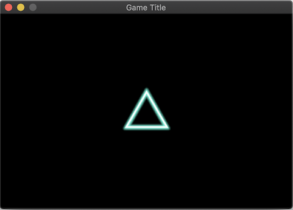
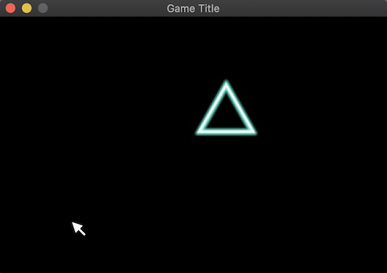
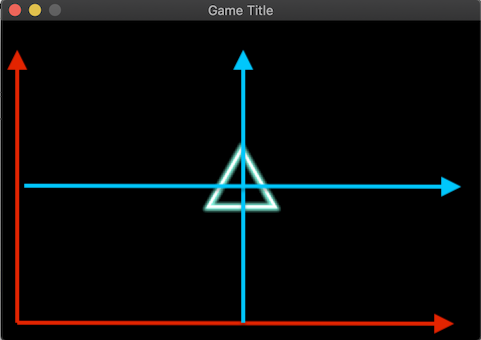
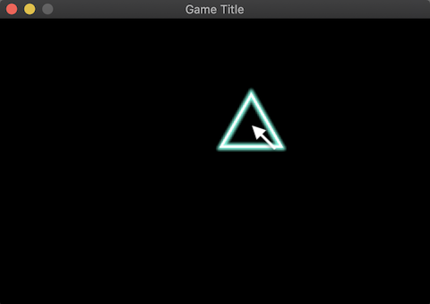

# Move Texture

In last chapter, we leanered how to act user's interaction. Now let's make the texture to follow the cursor pointer.

## Spawn Texture

First of all we need to create a texture in the way I introduced in chater 1.

```rust
struct PlayerShip;

fn setup(
    mut commands: Commands,
    mut materials: ResMut<Assets<ColorMaterial>>,
    asset_server: ResMut<AssetServer>,
) {
    commands
        //add 2D Camera    
        .spawn_bundle(OrthographicCameraBundle::new_2d());
    commands
        .spawn_bundle(SpriteBundle {
            material: materials.add(asset_server.load("triangle.png").into()),
            transform: Transform::identity(),
            sprite: Sprite::new(Vec2::new(80.0, 80.0)),
            ..Default::default()
        })
        .insert(PlayerShip);
}
```



## Move Texture

`Transform` is very important in this chapter. It indicates where the texture is located.

Thus the system we'll create requires `Transform` component with the query.(Remember chapter 2!)

```rust
fn move_player_system(
    mut query: Query<&mut Transform, With<PlayerShip>>,
) {
    for mut tr in query.iter_mut() {
        tr.translation.x += 1.;
        tr.translation.y += 1.;
    }
}
```

The triangle will move to right-up corner.

> Notice: Don't forget to add *With<PlayerShip>. If you remove *With*, the translation of the camera will be passed too. So the camera will move as well as the trinagle, and the triangle don't seem to move in the window.

## Follow cursor

To follow cursor, it requires `Event` we learned in chapter 3. Add `Event` and `EventReader` in the system.


```rust
fn follow_cursor_system(
    mut query: Query<&mut Transform, With<PlayerShip>>,
    mut events: EventReader<CursorMoved>,
) {
    //read mouse position
    if let Some(value) = events.iter().last() {
        for mut tr in query.iter_mut() {
            tr.translation.x = value.position.x;
            tr.translation.y = value.position.y;
        }
    }
}
```

The result will be shown



The positions of cursor and triangle are different. This is because difference of origin between window and texture.



In window(also cursor), origin is **left-down corner** (Red line). This means that *x:0-y:0* is located left-down corner. Though textures' origin is **center** (Blue line).

The distance between them comes from this reason. Thus we must adjust the location using `WindowSize`.

-----------------------

To know window size, we have to retrieve *Windows* in the system with using `Res`.

```rust
fn follow_cursor_system(
    mut query: Query<&mut Transform, With<PlayerShip>>,
    mut events: EventReader<CursorMoved>,
    windows: Res<Windows>, //Add this
) {
    let window = windows.iter().next().unwrap();
    if let Some(value) = events.iter().last() {
        for mut tr in query.iter_mut() {
            //subtract half of the window size 
            tr.translation.x = value.position.x - window.width() / 2.0;
            tr.translation.y = value.position.y - window.height() / 2.0;
        }
    }
}
```



Now the triangle follows the cursor!


## Limit moving speed

Although the triangle move as fast as the cursor. I want to move the triangle constant-speed. It means that we need to separate the abose system into 2 systems, *detecting cursor* and *moving triangle*.

It is also required to store the cursor position to use the position in *moving function*. Let's add the position to `PlayerShip`.

```rust
#[derive(Default)]
struct PlayerShip {
    target_x: f32,
    target_y: f32
}
```

And change the target_x/y values in the event system. 

```rust
fn follow_cursor_system(
    mut query: Query<&mut PlayerShip>, //Change Transform to Player
    mut events: EventReader<CursorMoved>,
    windows: Res<Windows>,
) {
    let window = windows.iter().next().unwrap();
    if let Some(value) = events.iter().last() {
        for mut player in query.iter_mut() {
            //Update player's target
            player.target_x = value.position.x - window.width() / 2.0;
            player.target_y = value.position.y - window.height() / 2.0;
        }
    }
}
```

Then create new function that moves player's position to the target.

```rust
fn move_player_system(
    mut query: Query<(&mut Transform, &PlayerShip)>
) {
    for (mut tr, player) in query.iter_mut() {
        let current = Vec2::new(tr.translation.x, tr.translation.y);
        let target = Vec2::new(player.target_x, player.target_y);
        let diff = target - current;
        if diff.length() >= 1.0 {
            let mv = diff.normalize();
            tr.translation.x += mv.x;
            tr.translation.y += mv.y;
        }
    }
}
```

The query doesn't use `With<PlayerShip>` because it needs player's target position so use *Transform and PlayerShip pair*. 

> `With` means the query want to fetch any entities associated with `PlayerShip` component, but don't want to fetch `PlayerShip` itself.

When running this, the triangle will move toward the cursor slowly.


## Rotating Triangle

Currently the triangle keeps its rotation upward only. We want to rotate it to the target(cursor) position.

First the angle between Y-Axis and the target position is required.


To calculate angle use `angle_between` and `Quat`.

```rust
//add these lines after move translation.
let y_axis = Vec2::new(0.0, 1.0);
let angle = y_axis.angle_between(diff);
tr.rotation = Quat::from_rotation_z(angle);
```

> Notica: rotation is created for 3D system so the code rotate the matrix around Z-Axis.

When you add these code, the traingle well follow the cursor and rotate toward it!  That's it!

# Summary

In this chapter I use all factors I introduced in the previous 3 chapters.

* Spawn a Texture
* Update the texture with `Query` 
* Event Reading

These are basic of all games. I want you to make your own code.

Next: Fire bullets!
