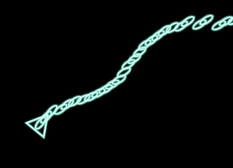
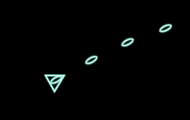

# Fire Bullets

We learened how to act when events happened and move the ship.

In this chapter I'll make firing bullets system with 'Left-Click'.


## Create Components

To begin with, a component are required for bullets like 'PlayerShip'.

```rust
struct Bullet;
```

It's simple because `Spirte` has the position of the bullet. All we have to do is to attribute the sprite as `Bullet`.

The code for making a bullet is

```rust
commands
  .spawn()
  .insert_bundle(
    SpriteBundle {
      material: materials.add(asset_server.load("elipse.png").into()),
      transform: tr,
      sprite: Sprite::new(Vec2::new(10.0, 20.0)),
      ..Default::default()
    }).insert(
      Bullet
    );
```

To fire bullet we need to do this when left-click event happens. Let's create it.

```rust
fn fire_bullet_system(
    input: Res<Input<MouseButton>>,
) {
    if input.pressed(MouseButton::Left) {
        //fire!
    }
}
```

We can listen events in this code but can't create a `Sprite`. More information we need.

* `PlayerShip` position to locate the bullet
* `Commands` to spawn
* `Material` and `AssetLoader` to create a texture

The parameters of the function will be

```rust
fn fire_bullet_system(
    mut commands: Commands,
    player: Query<&Transform, With<PlayerShip>>,
    mut gun_state: ResMut<GunState>,
    input: Res<Input<MouseButton>>,
    mut materials: ResMut<Assets<ColorMaterial>>,
    asset_server: ResMut<AssetServer>,
)
```

and spawn the bullet texture at the player's position.

```rust
let player_transform = player.iter().next().unwrap();
let tr = *player_transform;
commands
    .spawn()
    .insert_bundle(
        SpriteBundle {
            material: materials.add(asset_server.load("elipse.png").into()),
            transform: tr,
            sprite: Sprite::new(Vec2::new(10.0, 20.0)),
            ..Default::default()
        }).insert(
            Bullet
        );
```

Now you can see bullets when `left-click`, like this.


But these bullets don't move. 

## Move Bullets

In the last chapter, we made the player-ship following the cursor. In this time we have to move bullets forward.

So the code of the moving system is

```rust
fn move_bullet_system(
    mut bullets: Query<&mut Transform, With<Bullet>>,
) {
    for mut bullet in bullets.iter_mut() {
        let (v, a) = bullet.rotation.to_axis_angle();
        let angle = if v.z > 0. { a } else { -a };
        let tr = &mut bullet.translation;
        //notice: the angle when the ship toward upside is Zero,
        // left is PI/2, Down: PI, Right: -PI/2
        tr.x -= angle.sin() * 10.;
        tr.y += angle.cos() * 10.;
    }
}
```

After you make this, you will see the bullets move, but the bullets placed that go outside of the window will still remain in the Bevy system. We should `despawn` them to reduce the system-load.

We need to add some parameters like `left-click`

* `Commands` to despawn
* Also add `Entity` in the query to despawn the sprite.
* `Windows` to determine whether the bullet is outside or not.

```rust
fn move_bullet_system(
    mut commands: Commands,
    mut bullets: Query<(Entity, &mut Transform), With<Bullet>>,
    windows: Res<Windows>,
) {
    let window = windows.iter().next().unwrap();
    let win_w = window.width() / 2.;
    let win_h = window.height() / 2.;

    for (entity, mut bullet) in bullets.iter_mut() {
        let (v, a) = bullet.rotation.to_axis_angle();
        let angle = if v.z > 0. { a } else { -a };
        let tr = &mut bullet.translation;
        tr.x -= angle.sin() * 10.;
        tr.y += angle.cos() * 10.;
        //despawn it if outside of the window
        if tr.x < -win_w || tr.x > win_w || tr.y < -win_h || tr.y > win_h {
            commands.entity(entity).despawn();
        }
    }
}
```

Now you can fire bullets! 



Though I want to reduce bullets count. Every frame the ship fires bullets. Make firing every 5-frames.

This requires another `Component` to manage when to fire. I named it `GunState`

```rust
#[derive(Default)]
struct GunState {
    //when zero, the ship can fire a bullet.
    frames_to_fire: i32
}
```

This component differs from other components, like `PlayerShip` or `Bullet`. Only one-GunState is required and doesn't need to `spawn` and `despawn`.

> Playership also exists only one-entity, but I want to despawn it in gameover! 

And add this component as `Resource` to the system.

```
fn main() {
    App::build()
    //other codes
        .insert_resource(ClearColor(Color::rgb(0.0, 0.0, 0.0)))
        .insert_resource(GunState::default())
    //other codes
}
```

To use `GunState`, add `Res` to system function's parameter as `materials`.

```rust
fn system(
    gun_state: Res<GunState>, //read only
    mut gun_state: ResMut<GunState> //read and write
)
```

------------------------

Ok, let's change the fire-bullet system. Firing every 5 frames.

```rust
fn fire_bullet_system(
    mut commands: Commands,
    player: Query<&Transform, With<PlayerShip>>,
    mut gun_state: ResMut<GunState>,
    input: Res<Input<MouseButton>>,
    mut materials: ResMut<Assets<ColorMaterial>>,
    asset_server: ResMut<AssetServer>,
) {
    if gun_state.frames_to_fire <= 0 {
        // Spawn code as same as the above code
        gun_state.frames_to_fire = 5;
    } else {
        // reduce the timer value
        gun_state.frames_to_fire -= 1;
    }
}
```



Change the frame-count as you like! (I suppose some prefer firing every frames!)

## Summary

We made firing system. The system is very similar to PlayerShip-system.

However whole code is too long, it makes reading-code hard and less-maintainable.

In the next chapter, I'll separate this code into some files.

