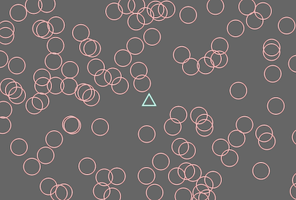
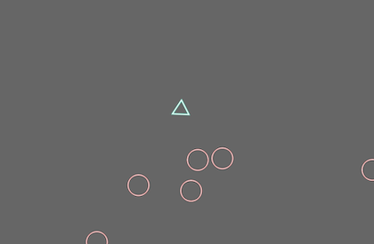

## Spawn Enemies

This chapter will focus on creating Enemies without Collision.

It's easy because similar to `Bullet System`.Let's begin.


## Random

First of all we want to spawn enemies at **randomized position**. Though the standard libraries in Rust doesn't have such functions so we need to use another crate, `rand`.

To do this, add the following line to `Cargo.toml`.

```toml
[dependencies]
bevy = "0.4"
rand = "0.8.3" #add!
```

`rand` is a very simple library but has a great feature. `rand` can create many types of random-values in just one function.

```rust
//boolean: true or false
if rand::random() {
    //integer_min to +integer_max
    let i = rand::random::<i32>();
} else {
    //floating value, [0..1)
    let f: f32 = rand::random();
}
```

## Enemy Systems

Before creating enemy-systems, I created `Plugin` to bundle all enemies system as well as the last chapter.

```rust
//enemy_plugin.rs
pub struct EnemyPlugin;
impl Plugin for EnemyPlugin {
    fn build(&self, app: &mut AppBuilder) {
        //add enemy-systems here
    }
    fn name(&self) -> &str {
        "EnemyPlugin"
    }
}
//Also need to add this plugin to main.rs   
```

The first system we need is creating enemies system which places enemies at random-position. However if the enemy spawns at player position, the game will end soon and the player feel frustrated. So place enemies random except player's position.

But I suppose that the function caluculating pos is a little long so I divided it as a separated function.

```rust
//calcurate position, but not close to player
fn create_enemy_position(player_transform: &Transform, win_w: f32, win_h: f32) -> Transform {
    let px = player_transform.translation.x;
    let py = player_transform.translation.y;
    let mut x: f32 = 0.0;
    let mut y: f32 = 0.0;
    while (true) {
        x = random::<f32>() * win_w - win_w / 2.;
        y = random::<f32>() * win_h - win_h / 2.;
        //avoid near place from player, to avoid immediate-collision
        let dx = px - x;
        let dy = py - y;
        if dx * dx + dy * dy >= 900.0 {
            break;
        }
    }
    Transform::from_translation(Vec3 {x: x, y: y, z: 0.})
}
```

I used very simple logic, repeating the process until desired position will be created. 

And spawn enemy using this function.

```rust
fn spawn_enemy_system(
    commands: &mut Commands,
    player: Query<&Transform, With<PlayerShip>>,
    windows: Res<Windows>,
    mut materials: ResMut<Assets<ColorMaterial>>,
    asset_server: ResMut<AssetServer>,
) {
    let playerTr = player.iter().next().unwrap();
    let window = windows.iter().next().unwrap();
    let win_w = window.width();
    let win_h = window.height();
    //
    commands.spawn(SpriteBundle {
        material: materials.add(asset_server.load("circle.png").into()),
        transform: create_enemy_position(&playerTr, win_w, win_h),
        sprite: Sprite::new(Vec2::new(30.0, 30.0)),
        ..Default::default()
    }).with(
        Enemy::default()
    );
}
```

This has a problem...spawn a enemy every frame! 



We need to manage enemy-spawn interval so add another component to reduce enemies. 

``rust
//components.rs
pub struct GlobalEnemyState {
    //when ==0, a new enemy will spawn.
    frames_to_spawn: i32
}
``

The only one-GlobalEnemyState is requered, do not need multiple states. This means `GlobalEnemyState` will be added to Bevy as `resource` in `EnemyPlugin`.

```rust
impl Plugin for EnemyPlugin {
    fn build(&self, app: &mut AppBuilder) {
        app
            .add_resource(GlobalEnemyState::default()) //add 
            .add_system(spawn_enemy_system.system());
    }
}
```

and modifiy its property in the spawning system.

```rust
fn spawn_enemy_system(
    commands: &mut Commands,
    mut globalState: ResMut<GlobalEnemyState>,
    //same as below
) {
    if global_state.frames_to_next_enemy > 0 {
        global_state.frames_to_next_enemy -= 1;
        return
    }
    global_state.frames_to_next_enemy = 90; //1.5sec
    //
}
```

The fig shows game screen about 10 seconds after launding.



Currently spawn-interval is fixed. But if you can change this interval during the playing, the difficulty will be changed dynamically.

## moving

Last, let's move enemies to the player. It's same as Player-move, the difference between player and enemies is following *cursor* or *player*.

```rust
fn move_enemy_system(
    mut enemies: Query<&mut Transform, With<Enemy>>,
    player: Query<&Transform, With<PlayerShip>>,
) {
    let playerTr = player.iter().next().unwrap();
    let px = playerTr.translation.x;
    let py = playerTr.translation.y;
    for mut enemy in enemies.iter_mut() {
        let ex = enemy.translation.x;
        let ey = enemy.translation.y;
        let mv = Vec2 {x: px - ex, y: py - ey}.normalize() * 0.5;
        enemy.translation.x += mv.x;
        enemy.translation.y += mv.y;
    }
}
```

Then the enemies will move forward to player. 

## Summary

In this chapter, We created enemy-system and used another library. 

But nothing happens when the enemies bump into the player or the bullets hit the enemies.

We'll create a collision system in the next chapter.


